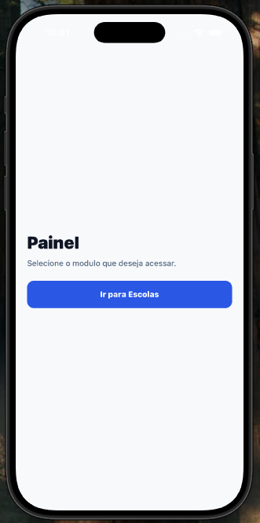
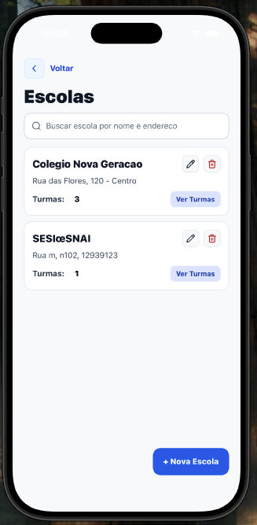
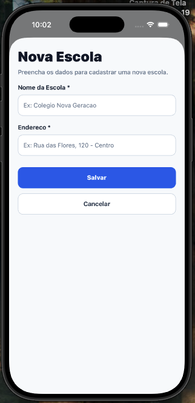
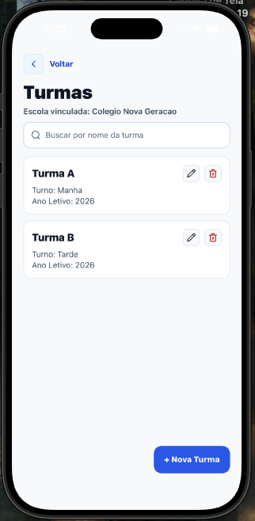
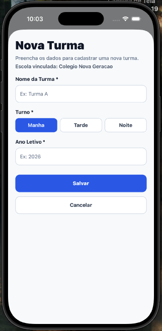

# School Control

Aplicativo mobile em React Native para controle de escolas e turmas, com foco em fluxo CRUD, busca com filtro e arquitetura modular.

## Objetivo

Gerenciar escolas e turmas de forma simples, com navegação clara, feedback visual de ações e cobertura de testes para os principais fluxos da feature School.

## Versoes instaladas

### Ambiente local

- Node.js: v24.14.0

### Base da aplicacao

- expo: ~54.0.33
- react: 19.1.0
- react-native: 0.81.5
- expo-router: ~6.0.23
- typescript: ~5.9.2

### UI e navegacao

- @gluestack-ui/core: ^3.0.14
- @gluestack-ui/utils: ^3.0.17
- @react-navigation/native: ^7.1.8
- nativewind: ^4.2.3
- react-native-safe-area-context: ^5.6.1
- react-native-screens: ~4.16.0
- react-native-toast-message: ^2.3.3

### Estado, dados e mock

- zustand: ^5.0.12
- axios: ^1.13.6
- miragejs: ^0.1.48

### Testes e qualidade

- jest: ^29.7.0
- jest-expo: ^55.0.11
- @testing-library/react-native: ^13.3.3
- eslint: ^9.25.0
- prettier: ^3.8.1

## Organização do projeto

A estrutura segue um padrão modular por domínio, muito usado na comunidade React Native para facilitar manutenção e evolução por times.

### Estrutura principal

- src/app
  - Rotas do Expo Router (entrada de navegação da aplicação)
- src/modules/school
  - adapters: contratos e interfaces do módulo
  - services: acesso a API
  - stores: estado global do módulo com Zustand
  - hooks: regras de UI e integração tela + store
  - screens: componentes de tela
  - types: tipos e DTOs
- src/modules/class
  - mesma estratégia estrutural do módulo School
- src/modules/shared
  - utilitários, componentes compartilhados e serviços transversais
- src/mocks
  - mock de API com MirageJS para desenvolvimento local

## Funcionalidades

### School

- Listagem de escolas
- Busca por nome/endereço
- Criação de escola
- Edição de escola
- Remoção de escola
- Navegação para turmas vinculadas

### Class

- Listagem de turmas por escola
- Busca por nome da turma
- Criação de turma
- Edição de turma
- Remoção de turma

### UX e feedback

- Toast de sucesso e erro para ações de salvar, atualizar e remover
- Layout responsivo com Safe Area para evitar sobreposição na barra de status

## Testes

Os testes atuais estão focados na feature School:

- Teste de store
  - src/modules/school/stores/**tests**/schoolStore.test.ts
  - valida criar, atualizar e remover no estado
- Teste de componente
  - src/modules/school/screens/**tests**/SchoolsScreen.test.tsx
  - valida renderização e interação principal da tela
- Teste de filtro
  - src/modules/school/hooks/**tests**/useSchool.filter.test.ts
  - valida comportamento de trim e busca do hook

## Como rodar o projeto

1. Instalar dependências

```bash
pnpm install
```

2. Rodar em ambiente de desenvolvimento

```bash
pnpm start
```

3. Rodar testes

```bash
pnpm test
```

4. Validar tipagem

```bash
pnpm exec tsc --noEmit
```

## Bibliotecas utilizadas

### Base da aplicação

- expo
- react
- react-native
- expo-router

### Navegação e UI

- @react-navigation/native
- react-native-safe-area-context
- react-native-screens
- lucide-react-native
- nativewind
- react-native-toast-message

### Estado e dados

- zustand
- axios
- miragejs

### Testes e qualidade

- jest
- jest-expo
- @testing-library/react-native
- react-test-renderer
- typescript
- eslint
- prettier

## Prints da aplicação

### Home



### Escolas



### Formulário de Escola



### Turmas



### Formulário de Turma



## Boas práticas aplicadas

- Separação por módulos de domínio
- Separação de responsabilidades por camada (screen, hook, store, service)
- Uso de tipagem forte com TypeScript
- Testes cobrindo estado, tela e regra de filtro
- Componentes compartilhados centralizados no módulo shared
